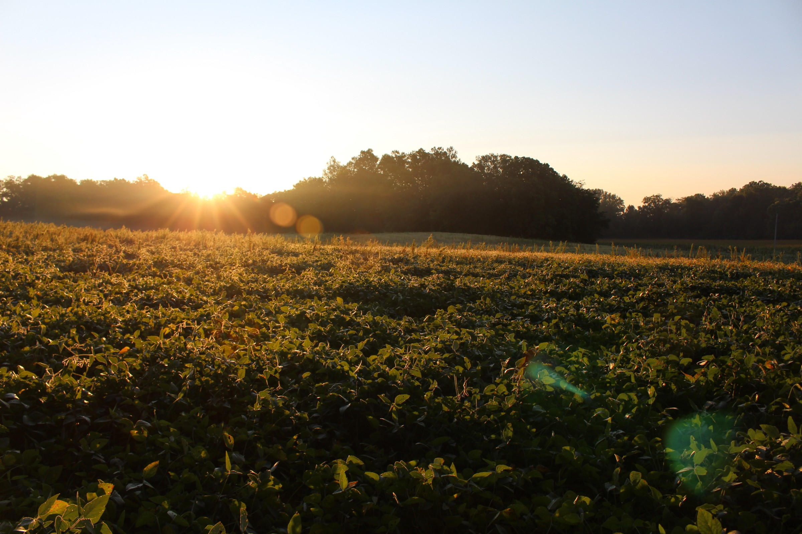

2017 was very much a challenging year (with one of the worst weeks of my life) but also a year of growth for me. At the beginning of the year, I was much more timid and I didn’t talk much. Now, I’m still timid and not very talkative, but much less so. I hope that 2018 will be another year of growth for me! I cannot wait to see what God has planned for me!

Isiah 43:16, 18–19

#### Goals for 2018

I only had one goal last year and I didn’t follow through with it totally (I’m only halfway to 365 photos). This year, I have a few goals.

1\. Study the Bible daily.  
2\. ‎Build more apps and websites. (easy)  
3\. Write a blog post at least monthly.  
4\. ‎Make another film! (see [Project CIC](https://412productions.com/films/cic))  
5\. ‎Grow [Filiosoft](https://filiosoft.com) to a decent steady income.  
6\. ‎Learn React, React Native, and Golang.  
7\. ‎Work at becoming a better photo/videographer