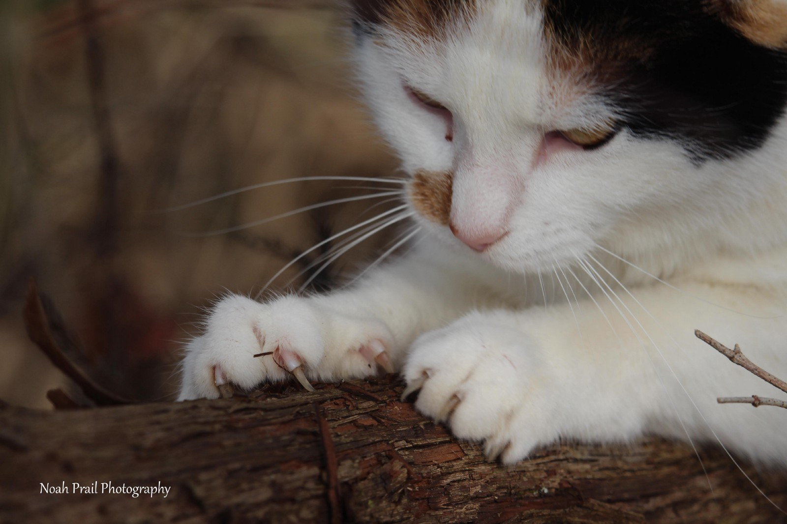

## January 28th, 2017 through January 28th, 2018

I have decided that I will be taking 1 photo (at least) per day during 2017 and posting them on social media. I have heard that it helps a lot with learning photography and cinematography. You will be able to find my photos on my Instagram, Facebook, Twitter, and Google+ (links below).

#### Why Start on January 28th Not on New Years Day?

I was extremely busy during the first week of January so I was unable to begin. So I decided to start on the Chinese New Year instead.

#### Camera

Most photos are taken with either my phone, a Google Nexus 5X, or a Canon Rebel T5i. I have a 55–300mm, 50mm, and 18–55mm lens.

#### Social Media

-   [Instagram](http://s.nprail.me/instagram)
-   [Facebook](http://s.nprail.me/fb)
-   [Google+](http://s.nprail.me/gplus)
-   [Twitter](http://s.nprail.me/twitter)

[**Noah Prail (@nprail) \* Instagram photos and videos**  
_103 Followers, 73 Following, 184 Posts - See Instagram photos and videos from Noah Prail (@nprail)_instagram.com](https://instagram.com/nprail "https://instagram.com/nprail")