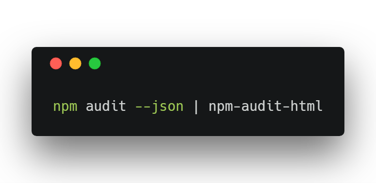

We just released a new CLI tool for creating HTML reports for NPM Audit! Yay! 🎉🎉🎉

Ever since NPM released the new [Audit tool](https://blog.npmjs.org/post/173719309445/npm-audit-identify-and-fix-insecure) for vulnerability detection, we have wanted a way to generate an HTML report. But no tools to do that existed and we didn’t see one being created in the foreseeable future. So we created a tool to do just that.

You can install the tool from NPM by running:

```
$ npm i -g npm-audit-html
```

It’s a fairly simple CLI interface. Once you install the tool, all you have to do is run `npm audit — json | npm-audit-html` and poof! You have an HTML audit report saved at `npm-audit.html`. If you want to specify where to save the file, just use the `--output` option like so `npm audit — json | npm-audit-html -o public/npm-audit.html`.

Now you are all set up to generate NPM security reports! 🎉🎉🎉



Upvote it on [Product Hunt](https://www.producthunt.com/posts/npm-audit-html) and check out the source code and full documentation on [GitHub](https://github.com/eventOneHQ/npm-audit-html)!