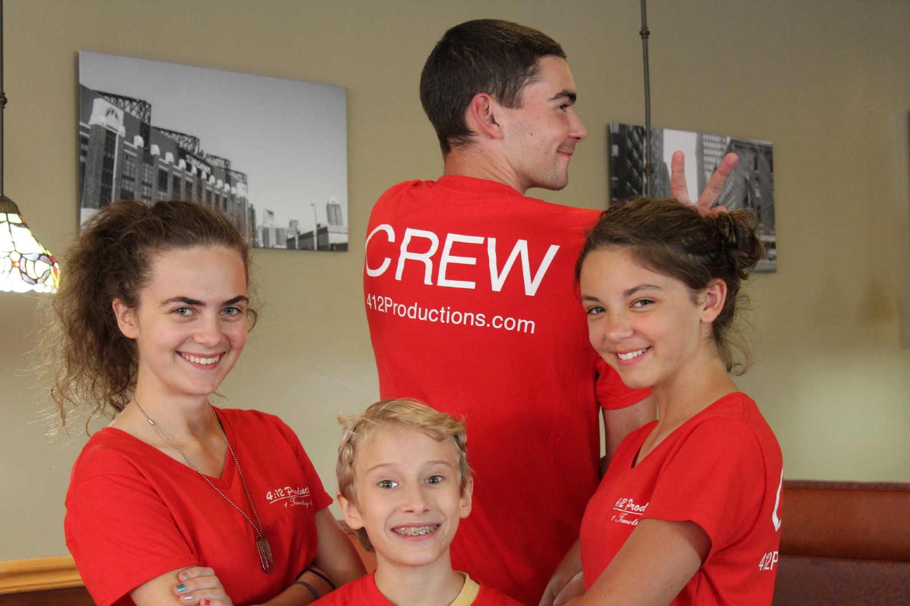

The 2017 Chuck Black video has been announced! And we have an announcement too! Drum roll, please… We will not be participating in the contest this year.

We really wish that we could participate. But we have another announcement! While we aren’t participating in the contest, we are working on another project!

Every year since our beginning, we have participated in the Chuck Black contest, winning second place in 2015 with our short film, [A Rebellion Born](https://412productions.com/Films/ARB). Now with three years of experience and three films, we decided to take our filmmaking to the next level. This year we decided not to participate in the contest and instead of filming a scene from a book, we wrote our own story from scratch! As a preview, here is a short synopsis of this project!

Fear is a matter that we each deal with daily. In this story, young Albert seeks to defeat his fear, and find courage, but his searches seem to lead to growing fear, not shrinking. On his journey, he encounters scenarios that put his entire being at risk. As he, his sister, and some close friends flee from a murderous landlord, Albert’s courage is put to the test. Will Albert find his courage in Christ, or will his fear be the end of him? Will the travelers be successful in fleeing the landlord, or will they be caught?

As we take our filmmaking to the next level, we will be needing a lot more funding. This film looks like it will be around an hour long which is 6 times longer than anything we have done before. Our projected budget of $5300 is 25 times larger than any budget we have had before! That means we really need your help to fund this project so we are launching a GoFundMe campaign to raise the funds we need! You can find the campaign here: [https://www.gofundme.com/2017-412-productions-films](https://www.gofundme.com/2017-412-productions-films) If you can’t support us financially, please share this campaign with all of your friends. We really do appreciate your support!

Thanks for your support!

In Christ,  
  
The 4:12 Productions Team